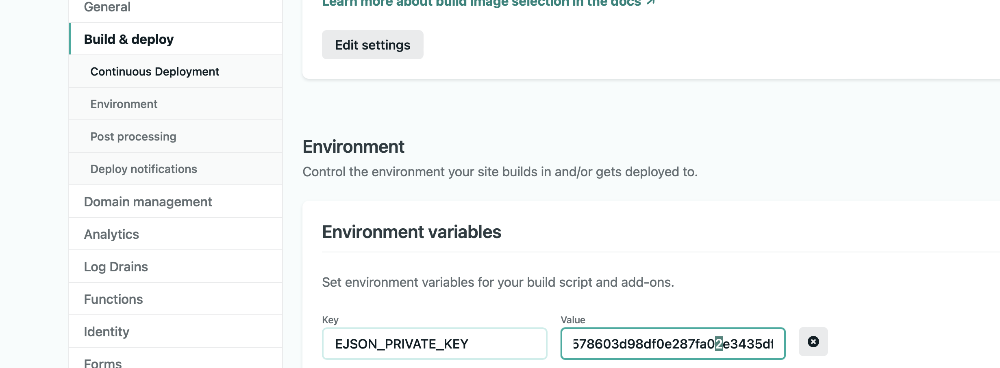

# netlify-plugin-ejson-env

A better way to store secret environment variables on netlify

## Usage

Install [ejson](https://github.com/Shopify/ejson) then generate a key pair:

```bash
$ ejson keygen

Public Key:
63ccf05a9492e68e12eeb1c705888aebdcc0080af7e594fc402beb24cce9d14f
Private Key:
75b80b4a693156eb435f4ed2fe397e583f461f09fd99ec2bd1bdef0a56cf6e64
```

store the private key to environment variable:

```bash
$ export EJSON_PRIVATE_KEY="75b80b4a693156eb435f4ed2fe397e583f461f09fd99ec2bd1bdef0a56cf6e64"
```

please make sure you store this private key in somewhere safe. Please don't lose
it!!

then create the `secrets.ejson` file in your project root folder:

```json
{
  "_public_key": "63ccf05a9492e68e12eeb1c705888aebdcc0080af7e594fc402beb24cce9d14f",
  "environment": {
    "SECRET_VAR1": "secret_in_plaintext"
  }
}
```

and then encrypt our secrets:

```
$ ejson encrypt secrets.ejson
```

the `SECRET_VAR1` should now have encrypted value, verify that easily with:

```
$ cat secrets.ejson

# stripped output
"SECRET_VAR1": "EJ[1:3eCI5YRF+jVXBa3I39lOjuM41HwX3k3dedBVMIIWyUk=:cobOAF#@(*&VLKJL#@"
```

and let's try to decrypt our secrets:

```
$ echo $EJSON_PRIVATE_KEY | ejson decrypt --key-from-stdin secrets.ejson

{
  "_public_key": "63ccf05a9492e68e12eeb1c705888aebdcc0080af7e594fc402beb24cce9d14f",
  "environment": {
    "SECRET_VAR1": "secret_in_plaintext"
  }
}
```

Next, please create a new environment variable in Netlify build settings:

```
EJSON_PRIVATE_KEY: "75b80b4a693156eb435f4ed2fe397e583f461f09fd99ec2bd1bdef0a56cf6e64"
```



Let's move on to install the plugin in the Netlify UI, use this
[direct in-app installation link](https://app.netlify.com/plugins/netlify-plugin-ejson-env/install)
or go to the [Plugins directory](https://app.netlify.com/plugins).

For file-based installation, add the following lines to your `netlify.toml`
file:

```toml
[[plugins]]
package = "netlify-plugin-ejson-env"

  # all inputs are optional, we just show you the defaults below
  [plugins.inputs]

  ejsonPrivateKeyEnvVarName = "EJSON_PRIVATE_KEY" # the environment variable name that contains the EJSON private key as value
  ejsonSecretsFilePath = "./secrets.ejson" # the EJSON file that contains encrypted key-value pairs
```

To complete file-based installation, from your project's base directory, use
npm, yarn, or any other Node.js package manager to add the plugin to
`devDependencies` in `package.json`.

```bash
npm install -D netlify-plugin-ejson-env
```

### Execution in Netlify

Once installed and configured, the plugin will automatically run in the Netlify
CI during its specified Netlify Build lifecycle event and all key-value pairs in
the secrets EJSON file would be populated as environment variables.

### Executing locally

To test the execution of the Netlify Build lifecycle locally, first ensure that
netlify-build is installed:

```bash
# Ensure that you have the netlify build command available
# (in future this will be provided via the CLI)
npm install @netlify/build -g
```

and [direnv](http://direnv.net) is installed:

```
cp .envrc.example .envrc
direnv allow
```

then in the project working directory, run the build as netlify would with the
build bot:

```
netlify-build
```

## Credits

- I borrow lots of the structure for this repo from
  [netlify-plugin-a11y](https://github.com/netlify-labs/netlify-plugin-a11y)
- Thanks to Shopify for the [ejson](https://github.com/Shopify/ejson)
